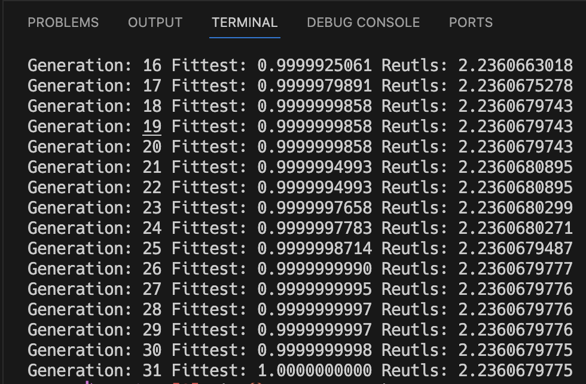

# genetic-algorithm-rs
Just Homework

> [!WARNING]
> This README is copies from my obsidian note, so may not have good format

> [!NOTE]
> * This Genetic Algorithm is implemented with `rust`

## Result



## Code

There are 5 part of my code

**Main function**

**One trait (used to define prototype of struct methods)**

* Chromosome

**Three struct**

* Genetic Algorithm
* Population
* Sqrt Chromosome

### Main Function

```rust
fn main() {
	// Configurations
    let uniform_rate = 0.5;
    let mutation_rate = 0.015;
    let tournament_size = 5;
    let elitism = true;
	// Create Population used to manage Chromosomes
    let mut population = Population::<SqrtChromosome>::new(uniform_rate, mutation_rate);
	// Create GA instance ueed to run ga algorithm
    let mut ga = GeneticAlgorithm::new(uniform_rate, mutation_rate, tournament_size, elitism);
    let mut generation_count = 0;
	// Initialize Population, which will randomly create 500 Chromosomes
    population.initialize(500);

	// loop while fitness <= 0.9999999999
    while population.get_fittest().get_fitness() <= 1_f64 - 10_f64.powi(-11) {
        // 2.2360679775
        generation_count += 1;
        println!(
            "Generation: {} Fittest: {:.10} Reutls: {:.10}",
            generation_count,
            population.get_fittest().get_fitness(),
            population.get_fittest().get_result()
        );
        population = ga.evolve_population(&mut population);
    }
}
```

### Chromosome Trait


> [!NOTE]
> 如果 struct 有 Chromosome 這個 Trait 就必須實作 Trait 中的函式

```rust
pub trait Chromosome
where
    Self: Ord + Clone,
{
    fn new(uniform_rate: f64, mutation_rage: f64, genetic_len: Option<usize>) -> Self;
    fn get_fitness(&self) -> f64; // get or caculate chromosome's fitness
    fn mutate(&mut self);
    fn crossover(&self, other: &Self) -> Self;
}
```

### Genetic Algorithm

```rust
pub struct GeneticAlgorithm {
    rng: ThreadRng,
    uniform_rate: f64,
    mutation_rate: f64,
    torunament_size: i32,
    elitism: bool,
}
```

#### Methods

##### 族群演化

```rust
// 族群演化
pub fn evolve_population<T>(&mut self, pop: &mut Population<T>) -> Population<T>
where
	T: Chromosome,
{
	let mut new_population = Population::new(self.uniform_rate, self.mutation_rate);
	let elitism_offset = if self.elitism { 1 } else { 0 };

	if self.elitism {
		let fittest = pop.get_fittest();
		new_population.chromosomes.push(fittest);
	}

	// 競爭與交配
	for _ in elitism_offset..pop.chromosomes.len() {
		let chromosome1 = self.tournament_selection(pop);
		let chromosome2 = self.tournament_selection(pop);
		// 勝者與勝者交配以此獲得更好的下一代
		let new_chromosome = chromosome1.crossover(&chromosome2);
		new_population.chromosomes.push(new_chromosome);
	}

	// 突變
	new_population
		.chromosomes
		.iter_mut()
		.for_each(|c| c.mutate());

	new_population
}
```

##### 族群競爭

```rust
fn tournament_selection<T: Chromosome>(&mut self, pop: &mut Population<T>) -> T {
	let mut tournament = Population::<T>::new(self.uniform_rate, self.mutation_rate);
	// 在原有族群中隨機選取n個
	for _ in 0..self.torunament_size {
		let random_id: usize = self.rng.gen_range(0..pop.size());
		tournament
			.chromosomes
			.push(pop.chromosomes[random_id].clone());
	}
	// 從這n個挑選最合適的(獲勝者)
	tournament.get_fittest()
}
```

### Population

```rust
pub struct Population<T> // genetic type
where
    T: Chromosome        // T should have trait Chromosome
{
    uniform_rate: f64,
    mutation_rate: f64,
    pub chromosomes: Vec<T>,
}
```

#### Methods

##### Initialize

```rust
impl<T: Chromosome> Population<T> {
    pub fn initialize(&mut self, size: i32) {
        for _ in 0..size {
			// create new chromosome into population
            let c = T::new(self.uniform_rate, self.mutation_rate, None);
            self.chromosomes.push(c);
        }
    }
}
```

##### Get_fittest

```rust
impl<T: Chromosome> Population<T> {
	pub fn get_fittest(&self) -> T {
        self.chromosomes
            .iter()
			// Select fittest chromosome
            .max_by(|a, b| a.get_fitness().partial_cmp(&b.get_fitness()).unwrap())
            .unwrap()
            .clone()
    }
```


### Sqrt Chromosome

```rust
#[derive(Debug, Clone)]
pub struct SqrtChromosome {
    genetic_len: usize,
    genetic: Vec<bool>,
    fitness: f64,
    target: u8,
    uniform_rate: f64,
    mutation_rate: f64,
}
```

#### Methods

```rust
impl Chromosome for SqrtChromosome {
    fn new(uniform_rate: f64, mutation_rate: f64, genetic_len: Option<usize>) -> Self {}
	fn get_fitness(&self) -> f64 {}
    fn mutate(&mut self) {}
    fn crossover(&self, other: &Self) -> Self {}
}
```

##### Get_fitness

```rust
fn get_fitness(&self) -> f64 {
	if self.fitness == 0_f64 {
		self.calculate_fitness()
	} else {
		self.fitness
	}
}

// [..16] -> number part: [..., true, false, true] = 0b101 = 5
// [16..] -> fractional part: [true, false, true, ...] = 2^-1 + 2^-3
fn calculate_fitness(&self) -> f64 {
	// spilit genetic into two part
	let (x, y) = self.genetic.split_at(16);
	// caculate number part
	let num: u32 = x.iter().fold(0, |acc, &x| acc << 1 | x as u32);
	// caculate fractional part
	let fra: f64 = y
		.iter()
		.enumerate()
		.fold(0_f64, |acc, (i, &cur)| match cur {
			true => acc + 2_f64.powi(-(i as i32 + 1)),
			false => acc,
		});
	// caculate: 1 - abs(5 - x^2)
	let dec = num as f64 + fra;
	let dis = (self.target as f64 - dec.powi(2)).abs();
	1_f64 - dis
}

```

##### Mutate

```rust
fn mutate(&mut self) {
	let mut rng = thread_rng();
	for i in 1..self.genetic_len {
		// randomly generate boolean with a probability mutation rate
		// if happen, then randomly set nth genetic
		if rng.gen_bool(self.mutation_rate) {
			self.genetic[i] = rng.gen();
		}
	}
}
```

##### Crossover

```rust
fn crossover(&self, other: &Self) -> Self {
	let mut new_chromosome = Self::new(self.uniform_rate, self.mutation_rate, None);
	let mut rng = thread_rng();
	// iterate both chromosome self and others
	new_chromosome.genetic = self
		.genetic
		.iter()
		.zip(other.genetic.iter())
		.map(|(x, y)| {
			// if uniform happen, then change genetic
			if rng.gen_bool(self.uniform_rate) {
				x.clone()
			} else {
				y.clone()
			}
		})
		// collect all genetic into Vec<bool> and set it to new chromosome
		.collect();
	new_chromosome
}
```
